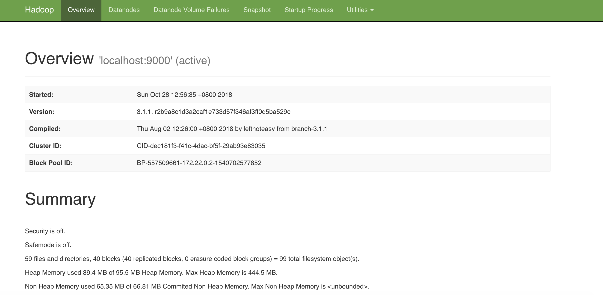
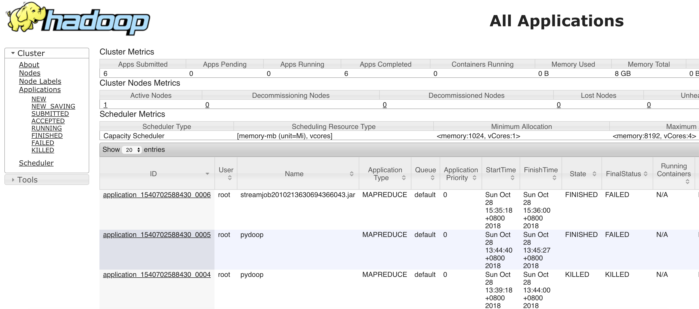

## How-to

1. Make sure you installed `Docker` and `Docker-compose`.

2. Spawn the container,
```bash
compose/build
```

3. Open new tab / window for terminal and access bash inside that container,
```bash
compose/bash
```

4. And you can start instructions below!

#### [Overview hadoop dashboard](http://localhost:9870)



You can check HDFS file system, Utilities -> Browse the file system


#### [Overview hadoop jobs](http://localhost:8088/cluster)



#### How to remove Yarn job

1. Get job id,
```text
2018-10-28 07:35:18,170 INFO impl.YarnClientImpl: Submitted application application_1540702588430_0006
2018-10-28 07:35:18,261 INFO mapreduce.Job: The url to track the job: http://6de2d313baf4:8088/proxy/application_1540702588430_0006/
2018-10-28 07:35:18,268 INFO mapreduce.Job: Running job: job_1540702588430_0006
```

2. kill the application,
```bash
yarn application -kill application_1540702588430_0006
```

#### HDFS basic command

Delete a HDFS directory,
```bash
hdfs dfs -rm -r /user/output_lower
```

Copy a HDFS directory to your local directory,
```bash
hadoop fs -get /user/output_lower
```

Copy a file to HDFS,
```bash
hadoop fs -put dictionary-test.json /user/dictionary-test.json
```

#### Distributing lowercase, [lowercase.py](lowercase.py)

1. Run hadoop streaming,
```bash
hadoop jar $HADOOP_HOME/share/hadoop/tools/lib/hadoop-streaming-3.1.1.jar -file lowercase.py -mapper lowercase.py -file reducer.py -reducer reducer.py -input /user/input_text/* -output /user/output_lower
```

2. Copy the HDFS output to your local,
```bash
hadoop fs -get /user/output_lower
```

3. Check [output_lower/part-00000](output_lower/part-00000)
```text
i love you so much
the story is a shit
the story is really good
the story totally disgusting
```

#### Mapping word with dictionary, [mapping.py](mapping.py)

1. Run hadoop streaming,
```bash
hadoop jar $HADOOP_HOME/share/hadoop/tools/lib/hadoop-streaming-3.1.1.jar -file mapping.py -file dictionary-test.json -mapper mapping.py -file reducer.py -reducer reducer.py -input /user/input_text/* -output /user/output_mapping
```

2. Copy the HDFS output to your local,
```bash
hadoop fs -get /user/output_mapping
```

3. Check [output_mapping/part-00000](output_mapping/part-00000)
```text
a: 5
disgusting: UNK
good: 45
i: 47
is: 9
is: 9
```

#### Distributing text classification, [classification.py](classification.py)

You can check the architecture of the model, a very simple model just for an example, [notebook](freeze-model.ipynb)

1. Run hadoop streaming,
```bash
hadoop jar $HADOOP_HOME/share/hadoop/tools/lib/hadoop-streaming-3.1.1.jar -file classification.py -file dictionary-test.json -file frozen_model.pb -mapper classification.py -file reducer.py -reducer reducer.py -input /user/input_text/* -output /user/output_classification
```

2. Copy the HDFS output to your local,
```bash
hadoop fs -get /user/output_classification
```

3. Check [output_classification/part-00000](output_classification/part-00000)
```text
i love you so much: negative
the story is a shit: positive
the story is really good: positive
the story totally disgusting: negative
```
